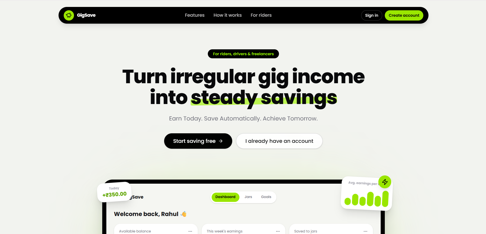
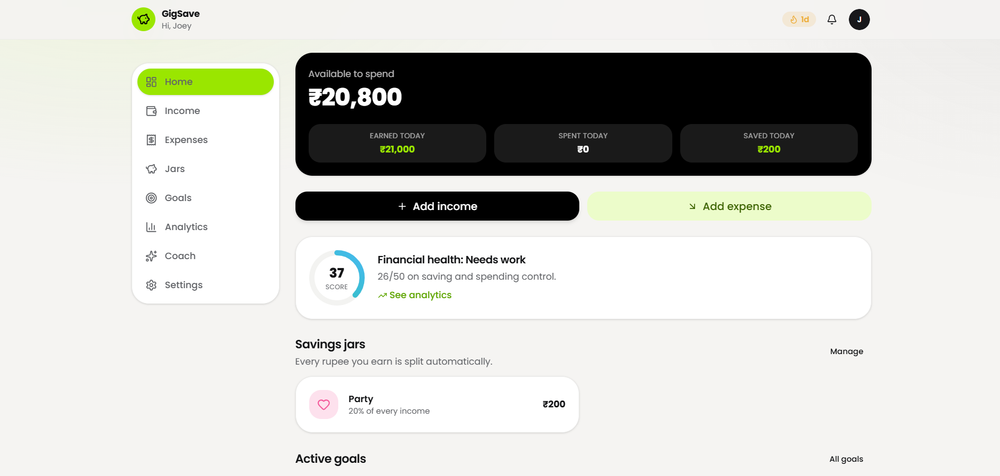
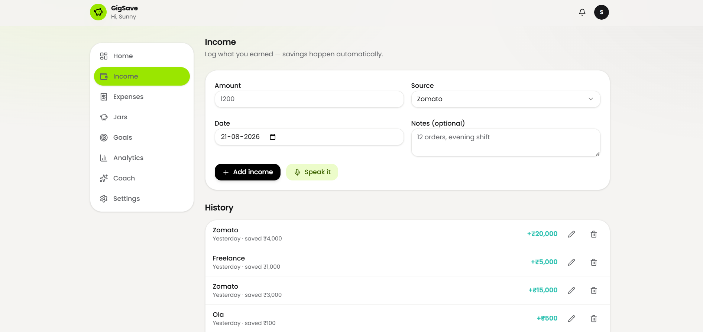
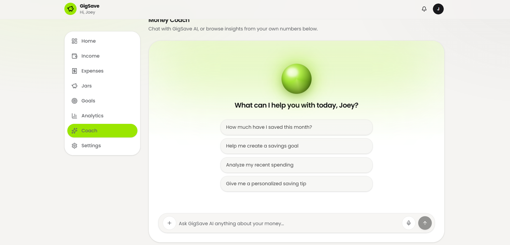
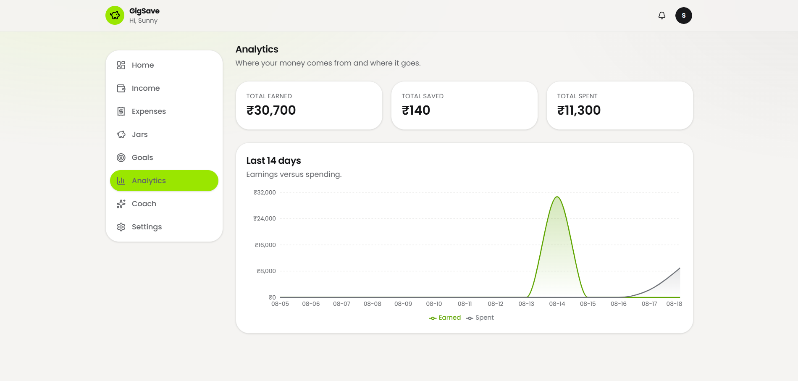
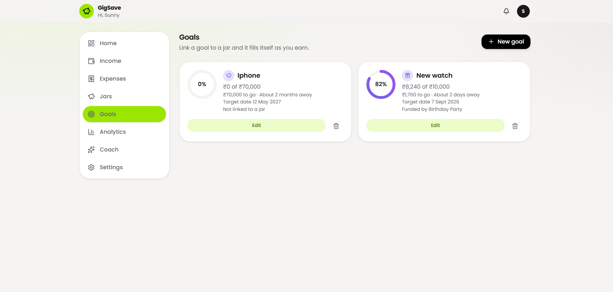

# 💚 GigSave

### AI-Powered Smart Income & Savings Assistant

<p align="center">
  <strong>Earn today. Save automatically. Achieve your goals.</strong>
</p>

<p align="center">
  A smart personal finance platform designed to help people with irregular income track their money, understand their spending, and build consistent savings habits.
</p>

<p align="center">
  
  
  
  
  
</p>

---

## ✨ What is GigSave?

GigSave is an **AI-powered personal finance assistant** built for people whose income isn't always the same every month.

Traditional budgeting applications often assume that users receive a predictable salary.

GigSave takes a different approach.

Whether you're a:

- 🚴 Gig worker
- 💻 Freelancer
- 🎓 Student
- 🧑‍💼 Salaried employee
- 🛍️ Part-time worker

GigSave helps you understand:

> **How much did I earn? Where did my money go? How much can I save?**

Instead of manually navigating through complicated financial forms, users can interact with GigSave using natural language through its AI assistant.

---

# 🚀 Core Features

## 💰 Smart Income & Expense Tracking

Track income and expenses in one place.

Users can record:

- Income
- Expenses
- Categories
- Merchants
- Dates
- Payment methods
- Notes

Every transaction is stored securely and reflected throughout the dashboard.

---

## 🤖 AI-Powered Financial Assistant

GigSave uses AI to understand natural-language financial commands.

For example:

```text
"I spent ₹850 at Burger King today."
```

GigSave can understand:

```text
Type       → Expense
Amount     → ₹850
Merchant   → Burger King
Category   → Food
Date       → Today
```

The transaction is then shown for confirmation before being added.

---

## 💬 AI Chat

Users can communicate naturally with GigSave instead of filling out complicated forms.

Examples:

```text
"I received ₹25,000 salary."

"I spent ₹400 on groceries."

"I paid ₹1,200 for electricity."

"I earned ₹5,000 from freelance work."
```

The AI converts conversational input into structured financial information.

---

## 📊 Financial Analytics

GigSave provides a visual overview of financial activity.

Users can understand:

- Monthly income
- Monthly expenses
- Net cash flow
- Spending categories
- Spending trends
- Savings progress
- Income vs expenses

Beautiful charts make financial information easier to understand at a glance.

---

## 🎯 Savings Goals

Create personalized savings goals and track progress.

Examples:

```text
New Laptop
Target: ₹60,000

Emergency Fund
Target: ₹25,000

Vacation
Target: ₹40,000
```

Progress is visualized so users can clearly see how close they are to their goals.

---

## 🔄 Subscription Tracking

Keep track of recurring expenses and subscriptions.

Examples:

- Netflix
- Spotify
- Amazon Prime
- Mobile recharge
- Internet
- Other recurring payments

Users can see upcoming renewals and recurring costs in one place.

---

## 🌍 Multi-Currency Support

GigSave is designed to support different currencies so users can manage their finances according to their preferred currency.

---

# 🎨 User Interface

GigSave uses a **premium light fintech interface** designed around:

- Clean white surfaces
- Emerald green accents
- Soft shadows
- Rounded cards
- Glassmorphism
- Minimal typography
- Smooth micro-interactions
- Responsive layouts

The goal is to make financial management feel simple rather than overwhelming.

---

# 🖥️ Screenshots

> Add your screenshots inside the `screenshots/` folder using the filenames below.

### 🏠 Landing Page

<p align="center">
  
</p>

---

### 📊 Dashboard

<p align="center">
  
</p>

---

### 💳 Transactions

<p align="center">
  
</p>

---

### 🤖 AI Assistant

<p align="center">
  
</p>

---

### 📈 Analytics

<p align="center">
  
</p>

---

### 🎯 Savings Goals

<p align="center">
  
</p>

---

# 🧠 How GigSave Works

```text
                ┌──────────────────┐
                │      USER        │
                └────────┬─────────┘
                         │
                         ▼
              ┌─────────────────────┐
              │   GigSave Web App   │
              └──────────┬──────────┘
                         │
             ┌───────────┴───────────┐
             │                       │
             ▼                       ▼
      ┌──────────────┐       ┌──────────────┐
      │ Transactions │       │   AI Chat    │
      └──────┬───────┘       └──────┬───────┘
             │                      │
             │                ┌─────▼─────┐
             │                │   Groq AI │
             │                └─────┬─────┘
             │                      │
             └──────────┬───────────┘
                        ▼
                 ┌─────────────┐
                 │  Supabase   │
                 │  Database   │
                 └──────┬──────┘
                        │
                        ▼
               ┌─────────────────┐
               │    Dashboard    │
               │ Analytics + AI  │
               │ Savings + Stats │
               └─────────────────┘
```

---

# 🛠️ Tech Stack

| Technology | Purpose |
|---|---|
| **React** | Frontend application |
| **Vite** | Development & build tooling |
| **TypeScript** | Type-safe development |
| **Tailwind CSS** | Styling |
| **shadcn/ui** | Reusable UI components |
| **Framer Motion** | Animations & interactions |
| **React Router** | Application routing |
| **Recharts** | Financial analytics & charts |
| **Supabase** | Authentication & database |
| **Groq** | AI-powered conversational processing |
| **Vercel** | Deployment |

---

# 🏗️ Project Architecture

```text
GigSave
│
├── public/
│   ├── favicon.ico
│   └── assets/
│
├── src/
│   │
│   ├── components/
│   │   ├── dashboard/
│   │   ├── transactions/
│   │   ├── analytics/
│   │   ├── savings/
│   │   ├── subscriptions/
│   │   ├── ai/
│   │   ├── navbar/
│   │   └── ui/
│   │
│   ├── pages/
│   │   ├── Landing.tsx
│   │   ├── Login.tsx
│   │   ├── Signup.tsx
│   │   ├── Dashboard.tsx
│   │   ├── Transactions.tsx
│   │   ├── Analytics.tsx
│   │   ├── SavingsGoals.tsx
│   │   └── Subscriptions.tsx
│   │
│   ├── hooks/
│   ├── services/
│   ├── lib/
│   ├── contexts/
│   └── App.tsx
│
├── supabase/
│   └── migrations/
│
├── screenshots/
│   ├── landing-page.png
│   ├── dashboard.png
│   ├── transactions.png
│   ├── ai-assistant.png
│   ├── analytics.png
│   └── savings-goals.png
│
├── .env
├── package.json
├── tsconfig.json
├── vite.config.ts
└── README.md
```

---

# 🗄️ Database

GigSave uses **Supabase** for authentication and persistent financial data.

Core entities include:

```text
profiles
categories
transactions
income
expenses
savings_goals
subscriptions
ai_insights
user_preferences
voice_history
```

Database changes are maintained through:

```text
supabase/migrations/
```

This allows the complete database structure to be reproduced on a fresh Supabase project.

---

# 🔐 Security

GigSave follows a user-based data access model.

Each authenticated user should only be able to access their own financial information.

Security considerations include:

- Supabase Authentication
- Row Level Security
- User-specific database queries
- Environment variables
- Server-side AI API handling
- No exposed AI API keys in the client

> Never commit `.env` files or API keys to the repository.

---

# ⚙️ Installation

## 1. Clone the repository

```bash
git clone https://github.com/YOUR_USERNAME/gigsave.git
cd gigsave
```

## 2. Install dependencies

```bash
npm install
```

## 3. Configure environment variables

Create a `.env` file:

```env
VITE_SUPABASE_URL=your_supabase_project_url
VITE_SUPABASE_ANON_KEY=your_supabase_anon_key
```

For the server-side Groq integration, configure the Groq secret according to the deployment/serverless environment.

**Do not expose the Groq API key through a `VITE_` variable.**

---

# 🗃️ Supabase Setup

Create a Supabase project.

Then apply the migrations located inside:

```text
supabase/migrations/
```

The migration files create the required database structure for GigSave.

Make sure Supabase Authentication is enabled before testing registration and login.

---

# ▶️ Run Locally

Start the development server:

```bash
npm run dev
```

Then open:

```text
http://localhost:5173
```

---

# 🏭 Production Build

Create a production build:

```bash
npm run build
```

Preview the production build:

```bash
npm run preview
```

---

# 📱 Responsive Design

GigSave is designed to work across:

- 🖥️ Desktop
- 💻 Laptop
- 📱 Mobile
- 📲 Tablet

The dashboard automatically adapts its layout depending on screen size.

---

# 🔮 Future Enhancements

GigSave is designed with an extensible architecture.

Planned enhancements include:

- 🎙️ Real-time voice assistant
- 🧠 Advanced AI financial recommendations
- 📊 Predictive spending analysis
- 🔔 Smart financial notifications
- 💡 Personalized saving recommendations
- 📅 Financial planning
- 🏦 Optional financial integrations
- 📈 Advanced forecasting

---

# 🎯 Project Goal

The goal of GigSave is simple:

> **Make personal finance easier for people whose income doesn't always follow a fixed pattern.**

Instead of making users adapt to complicated financial tools, GigSave adapts to the way people naturally talk about money.

---

# 👩‍💻 Built With

Built as a capstone project using modern web technologies, AI, cloud database services, and responsive UI design.

<p align="center">
  <strong>GigSave</strong><br>
  AI-Powered Smart Income & Savings Assistant
</p>

<p align="center">
  <i>Earn today. Save automatically. Achieve your goals.</i>
</p>